# ICS Cybersecurity Threat Detection using Machine Learning

This project focuses on detecting cyber threats in Industrial Control Systems (ICS) using multiple Machine Learning models. The goal is to analyze network traffic data and identify anomalies that may indicate potential cyber attacks.

---

## 📌 Project Overview

Industrial Control Systems (ICS) are critical for infrastructure such as power grids, water systems, and manufacturing. These systems are vulnerable to cyber attacks like **Stuxnet** and **Industroyer**.

In this project:

* Multiple ML models were trained and compared
* Network anomaly detection was performed
* Model performance was evaluated using standard metrics

---

## 🧠 Models Used

The following machine learning models were implemented:

* GRU (Gated Recurrent Unit)
* LSTM (Long Short-Term Memory)
* SVM (Support Vector Machine)
* Naive Bayes

Each model was trained separately using **Google Colab notebooks**.

---

## 📊 Evaluation Metrics

The models were evaluated using:

* Accuracy
* Precision
* Recall
* F1-Score
* Confusion Matrix
* ROC Curve

---

## 📁 Project Structure

```
ICS_ML_Project/
│── notebooks/        # Colab notebooks for each model
│── images/           # Model results and visualizations
│   ├── gru/
│   ├── lstm/
│   ├── svm/
│   ├── nb/
│   ├── comparison/
│── README.md
```

---

## 📷 Results

### 🔵 GRU Model

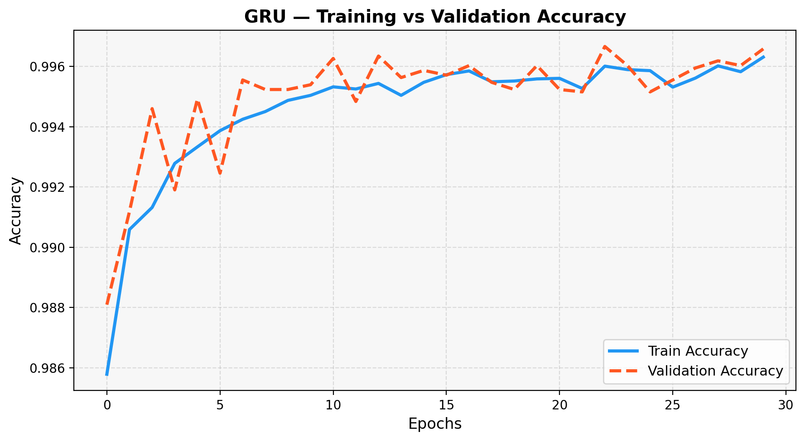
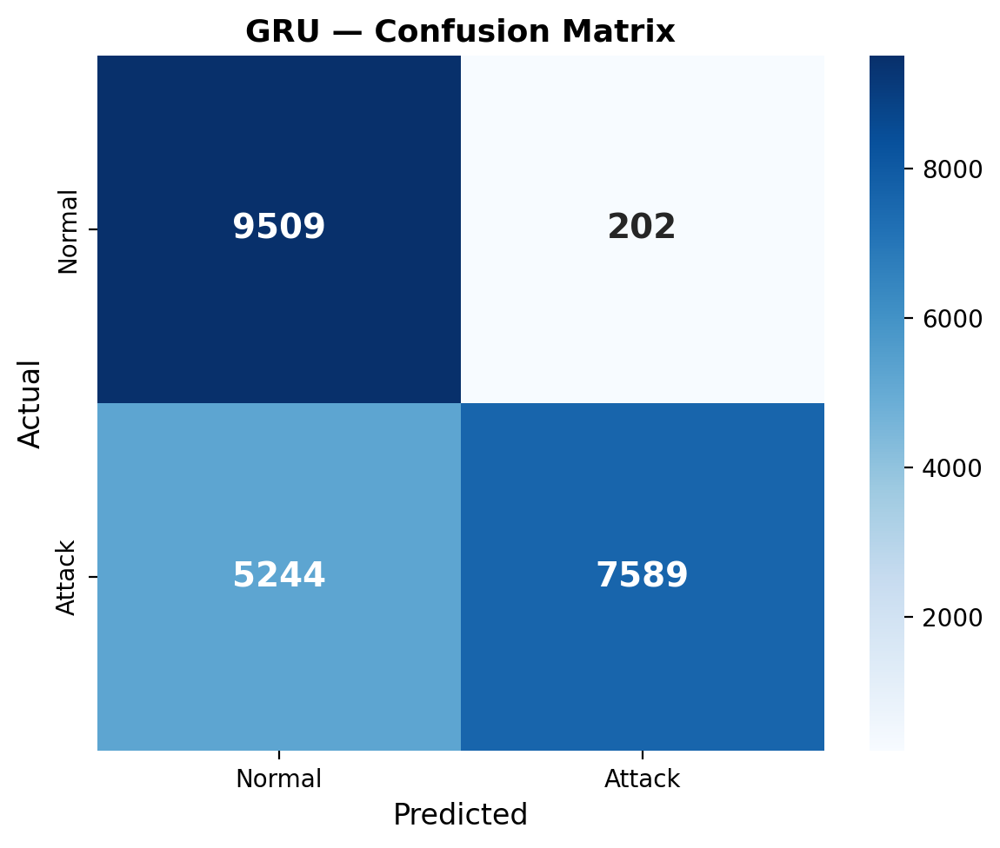

### 🟢 LSTM Model

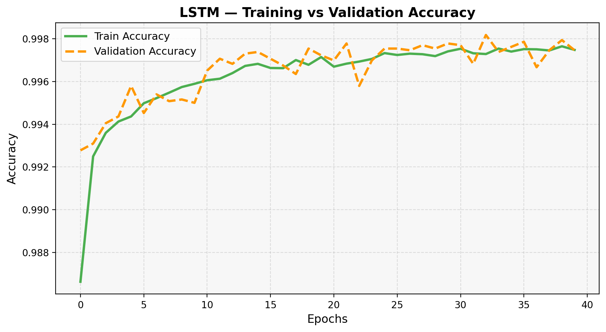
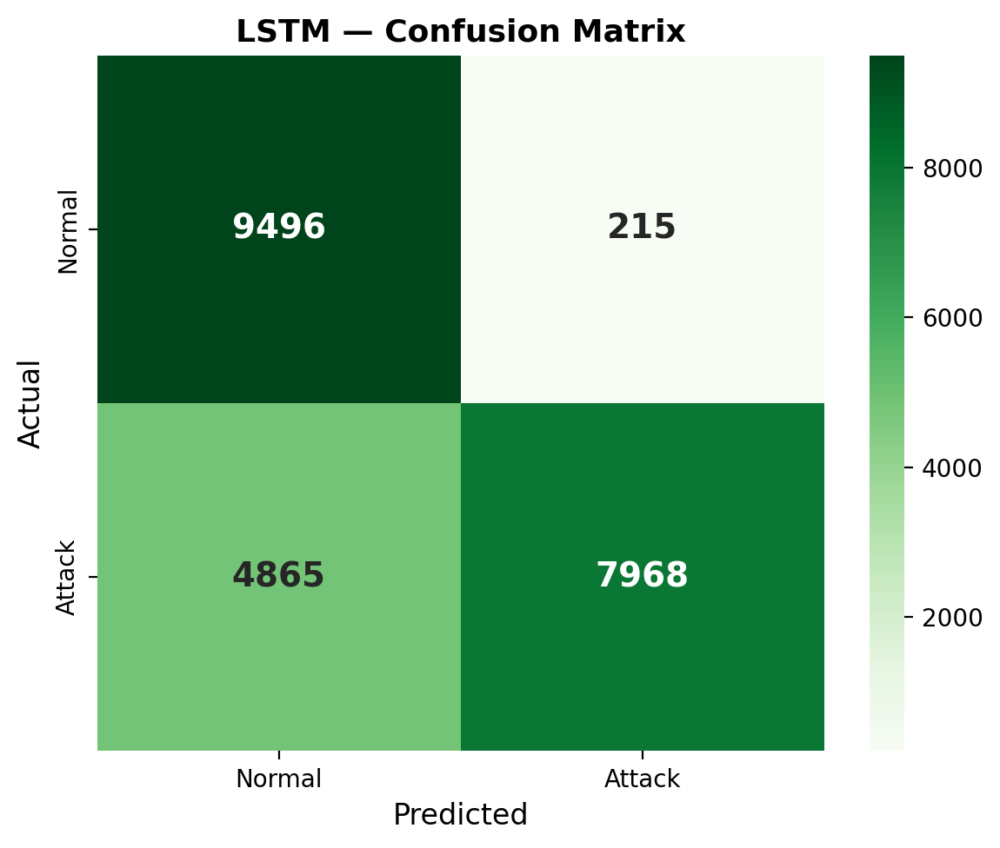

### 🔴 SVM Model
  
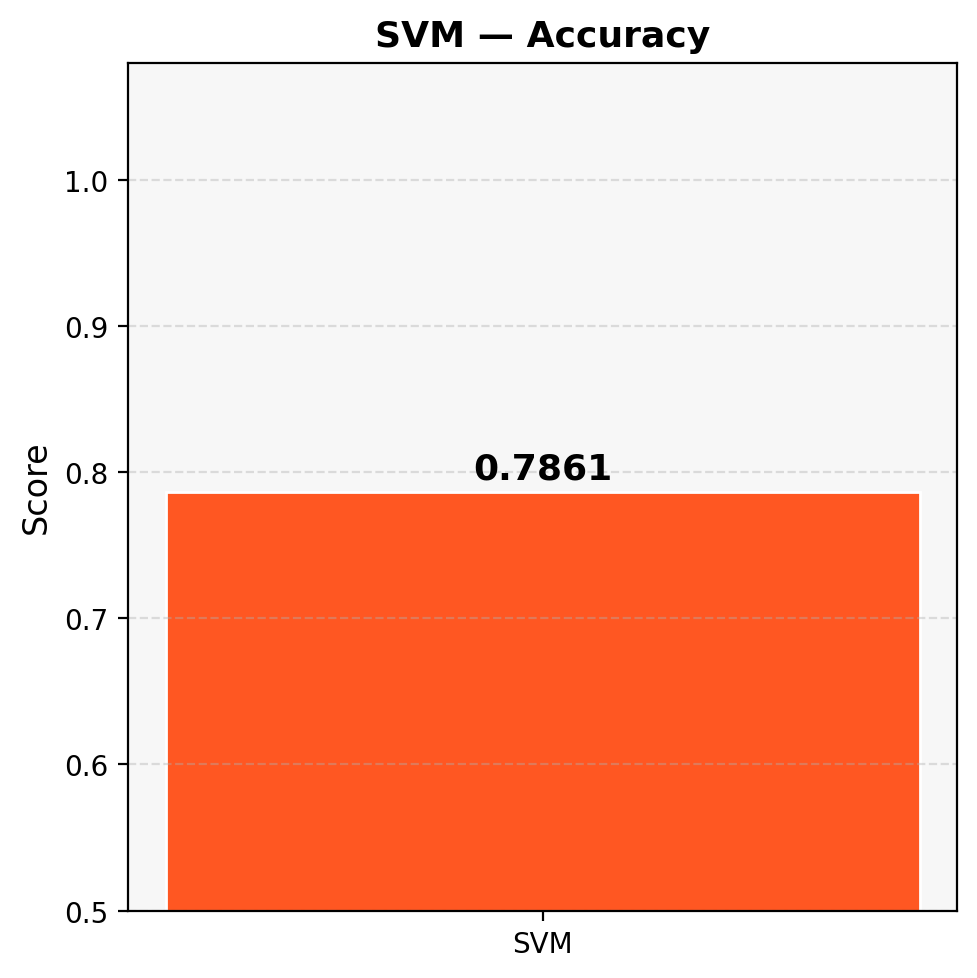
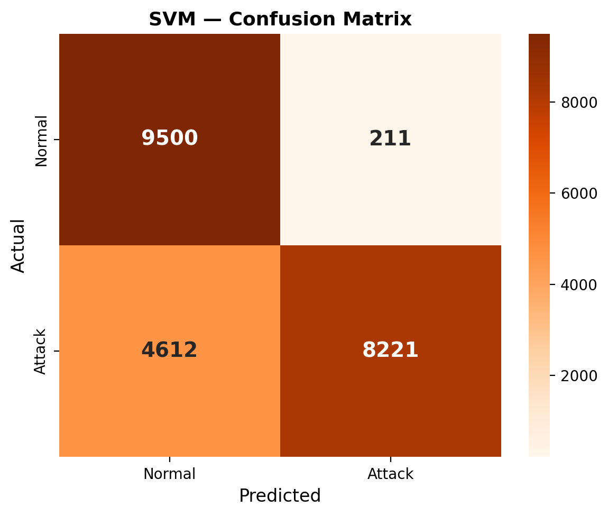

### 🟣 Naive Bayes Model

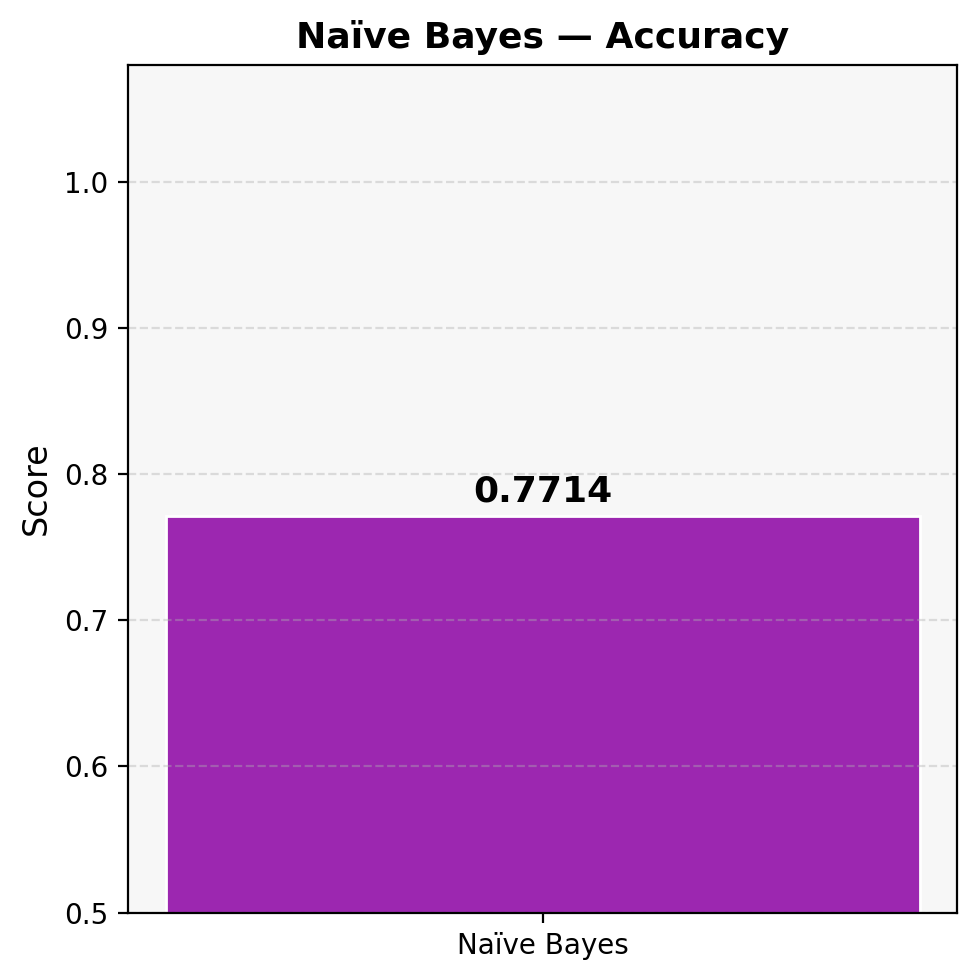
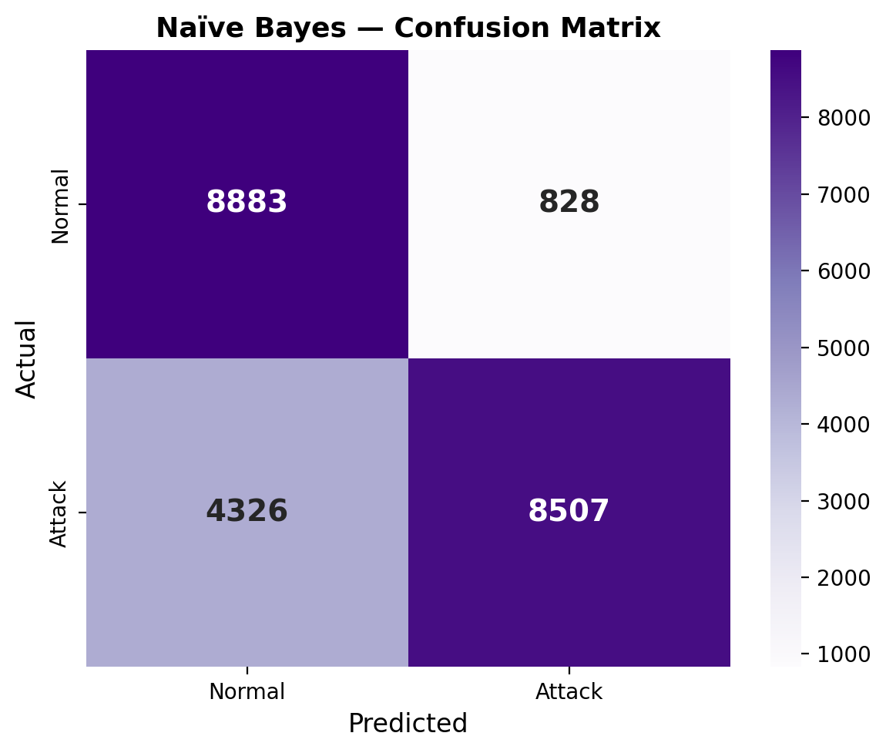

---

## 📈 Model Comparison

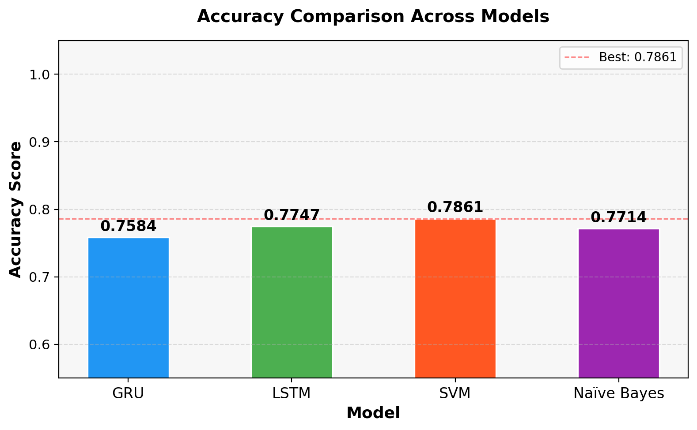
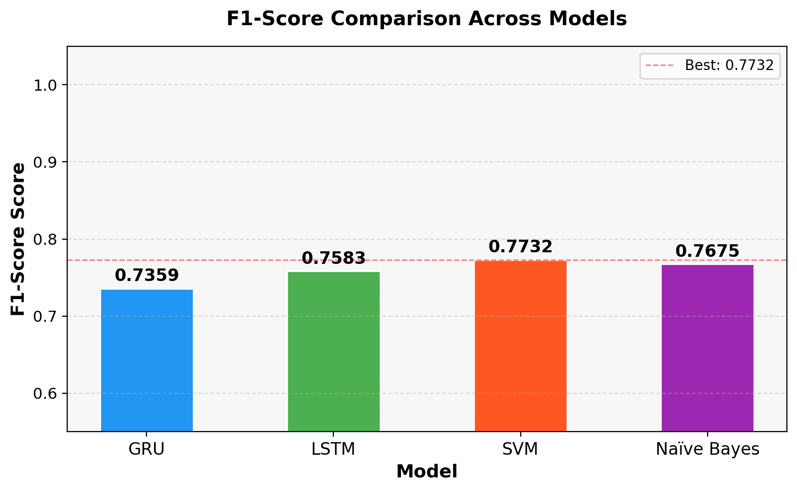
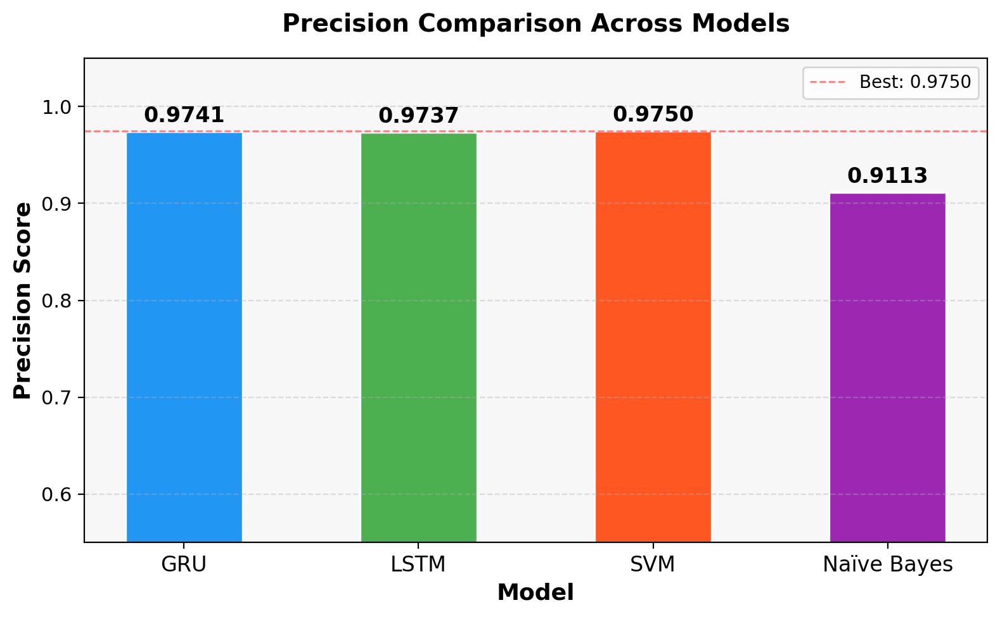

---

## 📊 Dataset

The dataset used in this project was obtained from an online source.


---

## ⚙️ How to Run

1. Open the notebooks in Google Colab
2. Install required libraries:

   ```
   pip install -r requirements.txt
   ```
3. Run each notebook cell step by step

---

## 📌 Key Highlights

* Multi-model comparison for ICS threat detection
* Visualization of model performance
* Real-world inspired cybersecurity use case
* Clean and modular project structure

---

## 🚀 Future Work

* Integration of real-time detection system
* Deployment using web interface
* Inclusion of more advanced deep learning models

---

## 👤 Author

Sreenija Akarapu
Anika Thukuntla
---

## ⭐ If you found this useful

Give this repository a ⭐ on GitHub!
